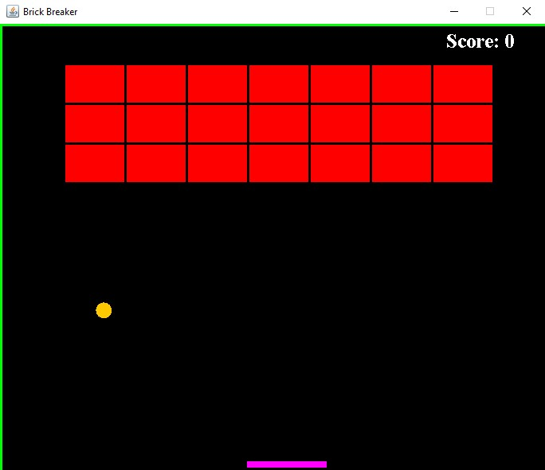

# Java Brick Breaker

## Description
A game in Java where the player must smash a wall of bricks by deflecting a bouncing ball with a paddle.

## Screenshots

## Table of Contents
 * [Installation](#installation)
 * [Usage](#usage)
 * [Contributing](#contributing)
 * [Questions](#questions)
        
## Installation
Clone this repository and open folder in appropriate IDE.
   
## Usage
Open Main.java and run the program. Use the left and right arrows on the keyboard to move the paddle.

## Contributing
Charity Rogers

## Questions
If you have any questions, please contact me!

  - GitHub: https://github.com/rogerscl116
  - Email: rogerscl116@gmail.com
  
